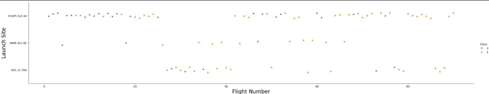
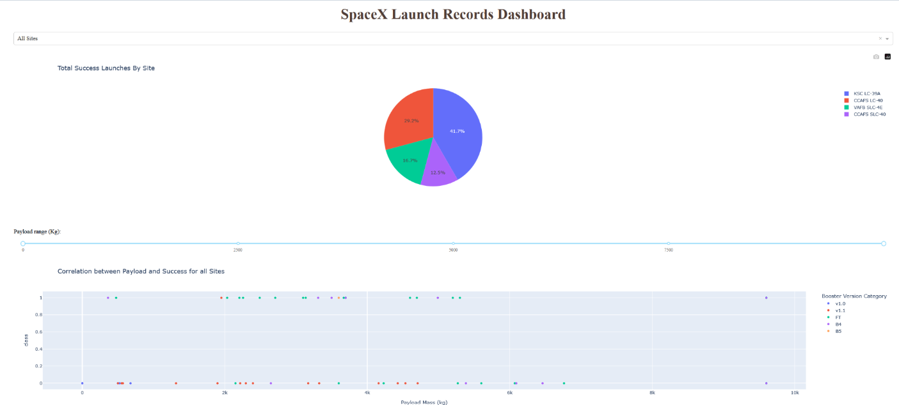
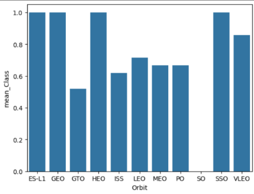

# 🚀 SpaceX Falcon 9 First Stage Landing Prediction

This is the final capstone project submitted as part of the **IBM Data Science Professional Certificate**. The objective is to predict the successful landing of the SpaceX Falcon 9 rocket's first stage, which is crucial for reducing launch costs through reusability.

---

## Project Objective

SpaceX's ability to reuse rocket boosters hinges on successful first-stage landings.  
As a data scientist for a competing aerospace firm, your task is to:

> **Build a machine learning model that predicts whether the Falcon 9 first stage will land successfully.**

This prediction will help inform your company’s bidding strategy for launch services.

---

## 📁 Project Structure

This end-to-end pipeline includes:
- ✅ Data collection (APIs, web scraping)
- ✅ Data wrangling and preprocessing
- ✅ Exploratory data analysis (EDA)
- ✅ Feature engineering and selection
- ✅ Model development and evaluation
- ✅ Dashboard visualizations (Plotly Dash, Folium)

---

## Tools & Technologies

- **Languages**: Python, SQL  
- **Libraries**: `pandas`, `numpy`, `scikit-learn`, `matplotlib`, `seaborn`, `plotly`, `dash`, `folium`, `bs4`  
- **ML Models**: Logistic Regression, SVM, Decision Tree, Random Forest, KNN  
- **Visualization**: Interactive dashboards using Dash and map rendering using Folium

---

## Data Collection

We collected the data primarily from 2 sources, using 2 methods:

1. Using SpaceX’s open REST API to pull live Falcon 9 launch data. The API provides structured JSON data containing:
- Mission name
- Launch date and time
- Rocket details
- Payload mass
- Launch outcome (success/failure)
- Landing type and outcome
- Launch site location

2. To supplement the API data, the project scrapes Wikipedia’s Falcon 9 launch log page to retrieve structured launch performance history and details not present in the API.
- BeautifulSoup and requests were used to extract table data.
- Specific HTML tables were parsed using `pandas.read_html()`

## 📊 Exploratory Data Analysis

EDA revealed key factors influencing landing success:
- Payload mass
- Launch site
- Booster version
- Orbit type

Visualizations included:
- Success rate by payload mass
- Launch site mapping
- Orbit-type success patterns

EDA was performed primarily with Pandas and Matplotlib after getting a working understanding using SQL queries.

*Figure 1: Scatter Plot showing relation between flight number nd launch site.*

---

## Model Building

Several classification models were trained and evaluated using accuracy, F1 score, precision, and recall.  
Cross-validation and grid search were applied to optimize hyperparameters.

| Model              | Accuracy | F1 Score |
|-------------------|----------|----------|
| Logistic Regression | 0.81     | 0.78     |
| SVM (RBF Kernel)   | **0.83** | **0.81** |
| Decision Tree      | 0.79     | 0.77     |
| KNN                | 0.76     | 0.74     |

**SVM with RBF kernel performed best overall.**

---

## Dashboards & Maps

Interactive dashboards were built to allow exploration of:
- Launch outcomes by site
- Payload and orbit combinations
- Success frequency maps

*Figure 2: Interactive dashboard visualizing launch success by payload*

Map visualizations were created using **Folium** to display launch locations and success outcomes.

---

## Key Insights

- Payloads between **2,000–5,000 kg** had the highest success rates.
- **CCAFS SLC 40** and **KSC LC 39A** were most reliable for landings.
- Certain booster versions were significantly more likely to land successfully.

---

## 🚀 Business Impact

The model and dashboard help:
- **Predict mission success** before launches
- **Advise bidding strategy** for reusability-based pricing
- **Guide engineering focus** on successful configurations

*Figure 3: Comparing Success Rates*

---

## 📌 Future Work

- Incorporate launch weather data and mission type for richer features
- Test ensemble models (e.g. XGBoost, LightGBM)
- Deploy a web app with real-time mission input + prediction
- Add SHAP values for model interpretability

---

## 🧾 Project Files

- `spaceX no. 1 API.ipynb` – Collected launch data via SpaceX REST API  
- `spaceX no. 1 webscraping.ipynb` – Scraped supplementary mission data from Wikipedia  
- `spaceX no. 2 wrangling.ipynb` – Cleaned, merged, and formatted datasets  
- `spaceX no. 3 SQL Querying.ipynb` – Loaded data into a SQLite DB and performed SQL analysis  
- `spaceX no. 4 EDA & Feat Engg.ipynb` – Exploratory Data Analysis and Feature Engineering  
- `SpaceX no. 5 Folium maps.ipynb` – Created interactive launch maps using Folium  
- `SpaceX no. 6 Dash App Analytics.py` – Built an interactive dashboard using Plotly Dash  
- `SpaceX no. 7 Predictive ML.ipynb` – Trained and evaluated classification models

---

## 👤 Author

**Adam Umar**  
Aspiring Data Scientist | Python, ML, DL, Data Engineering
[View Final Presentation (PDF)](SpaceX%20Predictive%20Analysis%20Findings%20Report.pdf)
[LinkedIn](https://www.linkedin.com/in/muhammad-adam-umar-26baaa2b5/) • [GitHub](https://github.com/MAdamUmar/)

---

## 📜 Acknowledgments

This project was developed as part of the **IBM Data Science Professional Certificate** on Coursera. Thanks to IBM, SpaceX, and the open data community for enabling this capstone.
